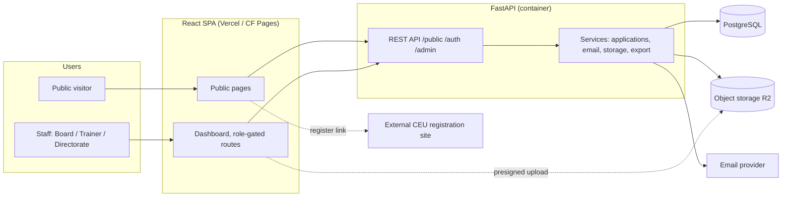
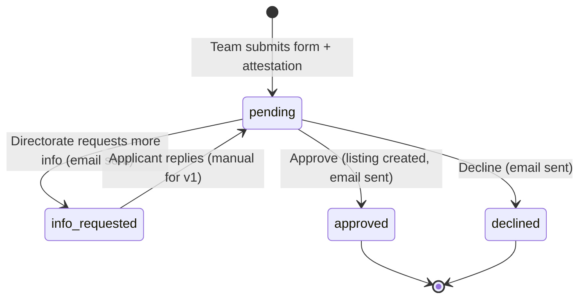
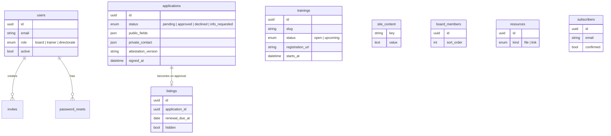

# White Crane Training Collective — Architecture Overview

Prepared by Autolinium, September 2026. For internal review.

## 1. What we are building

A public website for a DBT training nonprofit plus a private, role-gated dashboard. Four modules, one codebase, four-week build:

| Module | Public side | Dashboard side |
|---|---|---|
| Landing | Mission / vision / values, Board bios | Board edits text and bios |
| Trainings | Catalogue, detail pages, "upcoming" list; registration links out to an external CEU platform | Trainers manage trainings |
| Clinical Directory | Team application form with attestation; searchable directory of approved teams | Directorate reviews, approves, declines, requests info; tracks renewals |
| Resources + distribution list | Links / files; email sign-up | Board manages resources, exports subscribers |

Out of scope for v1 (planned as later phases): on-site payments, newsletter sending, automated renewal reminders, individual clinician listings.

## 2. Stack

| Layer | Choice | Why |
|---|---|---|
| Frontend | React 18, Vite, TypeScript, React Router, TanStack Query, react-hook-form + zod, Tailwind + shadcn/ui | One SPA serves public site and dashboard; small team, fast iteration |
| Backend | FastAPI, Python 3.12, SQLAlchemy 2, Alembic, Pydantic v2 | Typed API, auto OpenAPI, team already fluent in Python |
| Database | PostgreSQL 16 | Relational data (applications → listings), full-text search is enough at this scale |
| Auth | JWT access + refresh in httpOnly cookies; bcrypt | No third-party IdP needed for ~10 staff users |
| Files | S3-compatible object storage (Cloudflare R2), presigned uploads | Logos, photos, resource PDFs never touch the API server |
| Email | Transactional provider (Resend or Postmark), Jinja2 templates | Application confirmations, decisions, invites, resets |
| Hosting | Managed: static frontend on Vercel/CF Pages, API container on Railway/Fly, managed Postgres (Neon) | Lowest ops burden; estimated 20–70 USD/month total. VPS + Docker Compose is the fallback |
| CI/CD | GitHub Actions: lint, typecheck, pytest, build, deploy on `main`; preview deploys per PR | |
| Observability | Sentry (both sides), uptime monitor | |

## 3. System diagram



## 4. Roles and access

| Role | Dashboard access | Notes |
|---|---|---|
| Board | Everything, including user management | Super-admin; creates the other logins |
| Trainer | Trainings only | Added after client feedback; not in the original PRD |
| Directorate | Applications, Listings, Renewals only | Directory reviewers |
| Public | None | Browse, apply, subscribe |

Enforced in two places: `require_role()` FastAPI dependency on every `/admin/*` route, and a `<RequireRole>` guard on dashboard routes. Backend is the source of truth; the frontend guard only shapes navigation.

## 5. Core workflow: directory application



On approval a `listing` row is created 1:1 from the application with `renewal_due_at = now + 1 year`. Listings past their renewal date are hidden from the public directory automatically but never deleted; the Directorate sees them in "Renewals due" and can mark them renewed. Automated reminder emails are a later phase, so the data model already carries the date.

## 6. Data model



Ten tables total. No ORM inheritance, no polymorphism; each dashboard page maps to one table.

## 7. Repository layout

```
white-crane/
├── apps/
│   ├── web/                  React + Vite SPA
│   │   └── src/{api,auth,components,pages/{public,auth,dashboard},hooks,lib}
│   └── api/                  FastAPI
│       └── app/{core,db,models,schemas,services,routers/{public,auth,admin},emails,jobs}
├── infra/                    docker-compose (postgres + mailpit), hosting config
└── .github/workflows/        ci.yml, deploy.yml
```

Monorepo, pnpm for web, uv for api. The OpenAPI spec from FastAPI generates the typed TS client, so request/response shapes cannot drift.

## 8. Request path (typical dashboard action)

1. Directorate clicks "Approve" on an application.
2. SPA calls `POST /admin/applications/{id}/approve` with the httpOnly cookie.
3. `current_user` dependency validates the JWT; `require_role("board","directorate")` checks access.
4. `applications.approve()` service runs one transaction: set status, create listing, enqueue decision email.
5. Email sent via provider as a background task; failure is logged to Sentry, does not roll back the approval.
6. TanStack Query invalidates the applications and listings caches; UI updates.

## 9. Security and data handling

- Applicant private contact details are stored separately from public listing fields and never returned by `/public/*` endpoints.
- Attestation text is versioned; each application records which version was signed and when.
- Presigned upload URLs expire in minutes; the API never proxies file bytes.
- Rate limiting on `/public/applications` and `/public/subscribe`; honeypot field on both forms.
- Passwords: bcrypt, minimum 10 characters; reset and invite tokens single-use with expiry.
- Subscriber export is CSV only, Board role only, logged.

## 10. Delivery plan

| Week | Deliverable |
|---|---|
| 1 | Scaffold, CI, auth + roles, dashboard shell, landing content, application form |
| 2 | Directorate workflow + emails, public directory, trainings CRUD + public pages, resources |
| 3 | Subscribers + export, all transactional email, content load, role-by-role QA, client review |
| 4 | Fixes, walkthrough, handover of logins, domain cutover, go-live |

Timeline starts when the client checklist (domain, branding, attestation text, user list, registration platform) is complete. Client has already confirmed the user list; branding is in progress.

## 11. Decisions still open

| Question | Recommendation |
|---|---|
| Trainer role not in client-facing PRD v1.1 | Issue PRD v1.2 before build starts |
| SEO for public pages (SPA) | Prerender public routes at build time with vite-plugin-prerender; decide day one |
| Subscribers export for Trainers | Board only until client asks |
| Hosting | Managed stack as above; revisit only if client objects to multiple vendors |

## 12. Related documents

- Client PRD v1.1 (Word, PAD format)
- Wireframes: Figma https://www.figma.com/design/Cs0CqbmsybQlxUprrWBsWm and `white_crane_wireframes.html`
- Developer README (setup, routes, API surface, env)